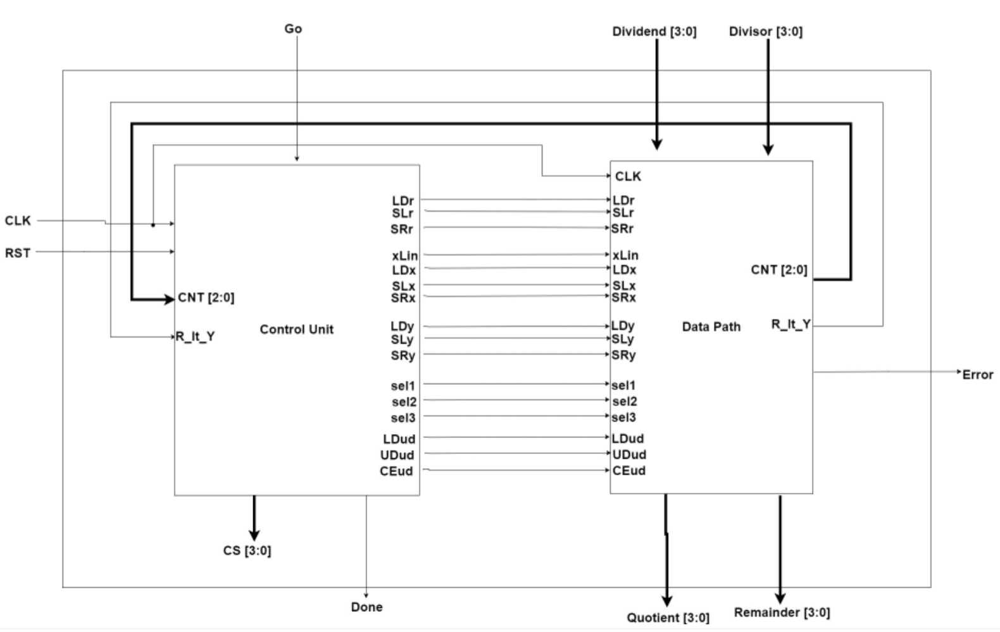
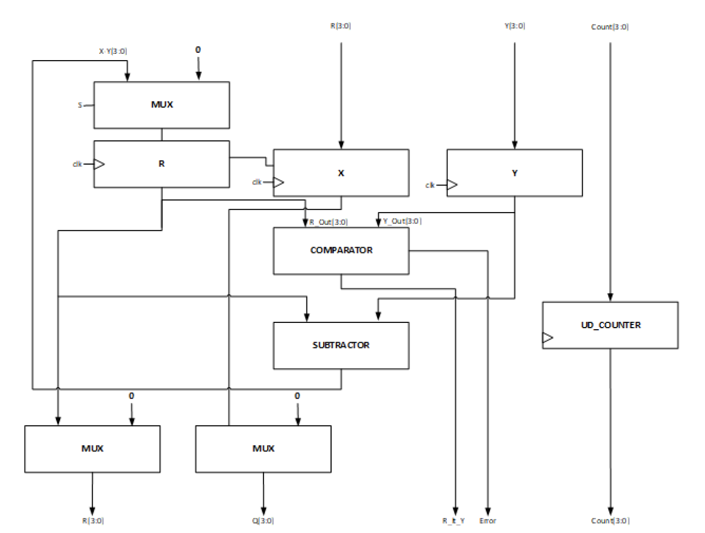
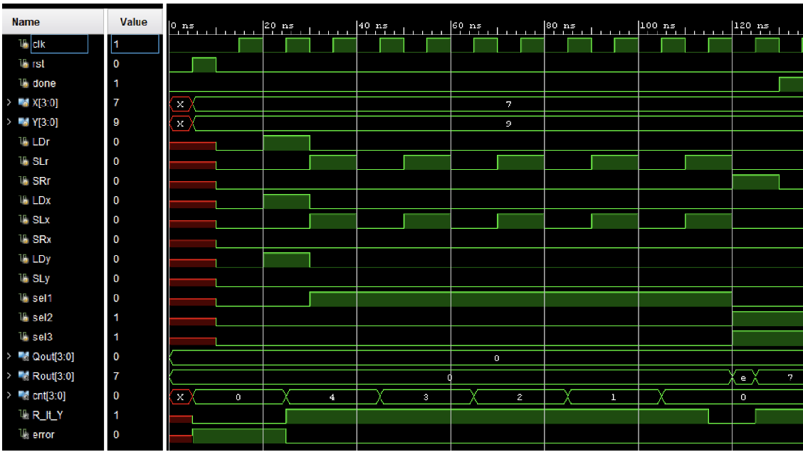

# Pipelinable Integer Divider

The purpose of this lab was to design a 4-bit unsigned integer divider. 

This system is
built up of a data path and a control unit. 

The data path unit is constructed of several submodules
needed to support the division operation that is the ultimate goal of the lab. 

The team utilizes the
Restoring Algorithm for Integer Division as a model to shape the functionality of the data path
and the needed stimuli that the control unit must generate. 

The functional verification section of the report the team showcases the results of the simulations
of the CU_DP testbench.

