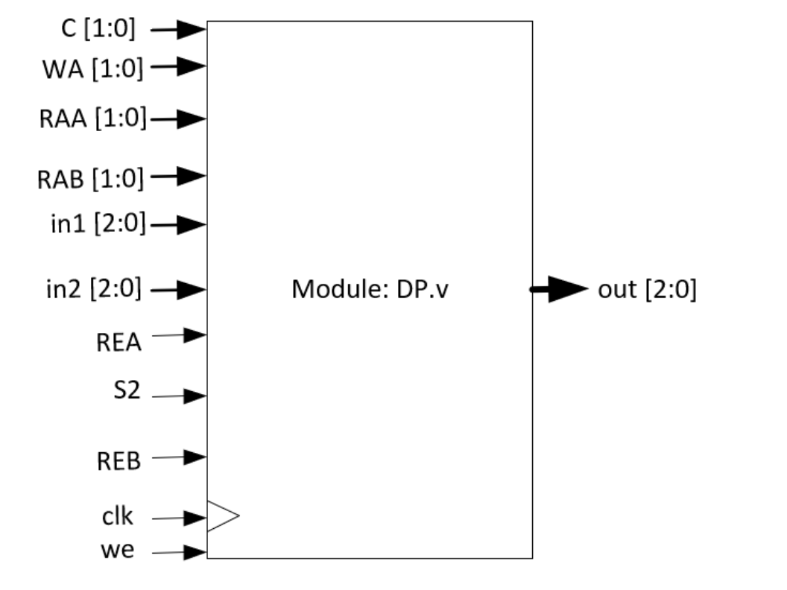
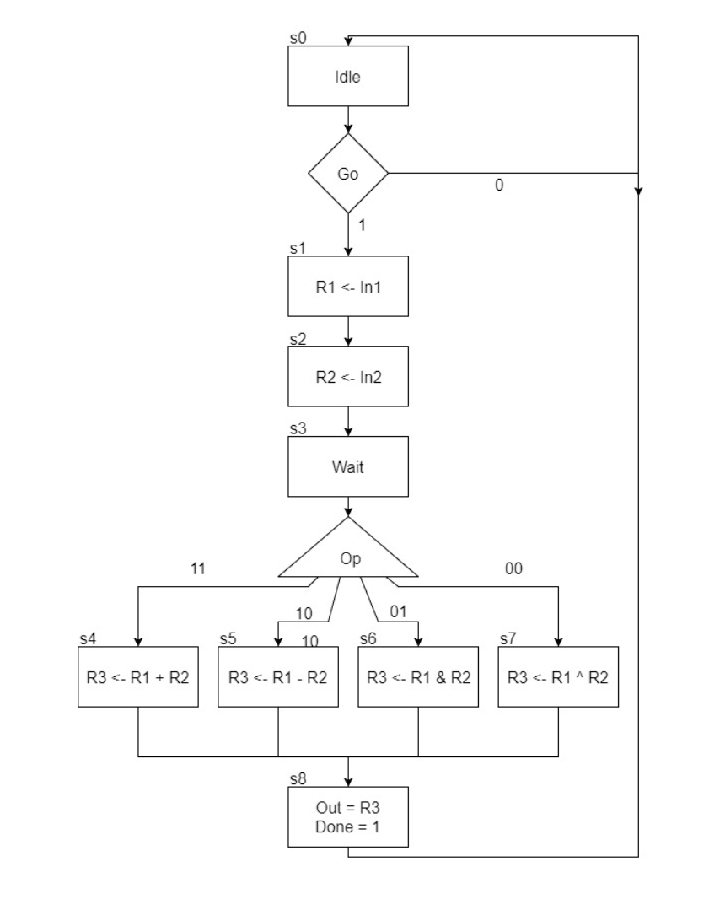
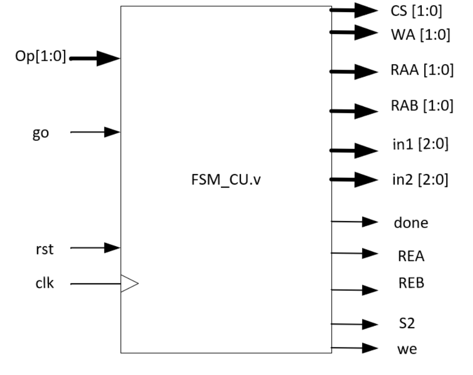
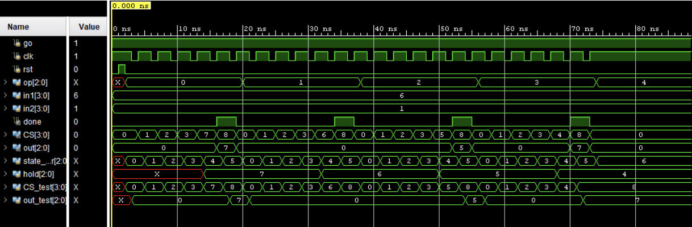
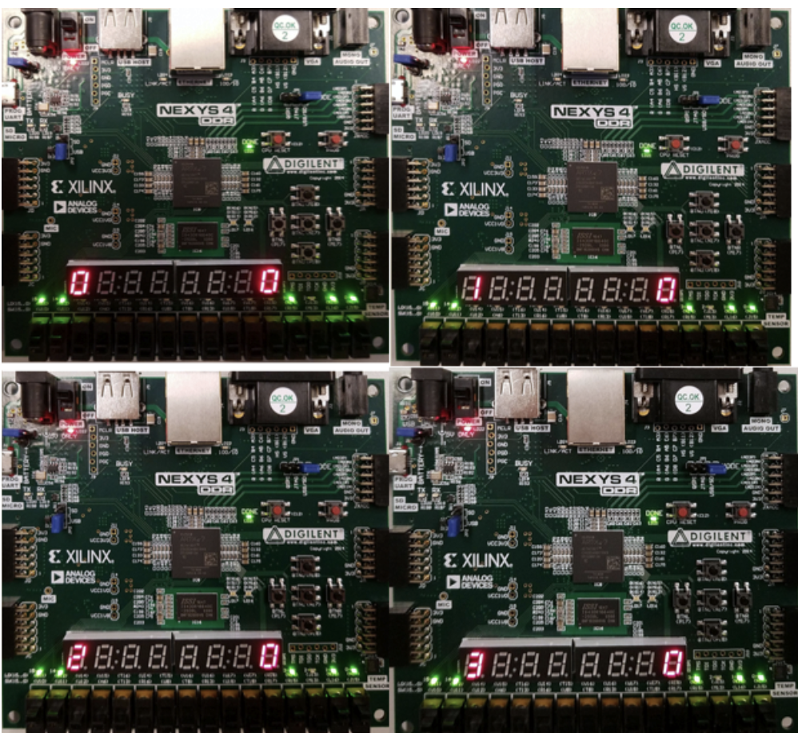
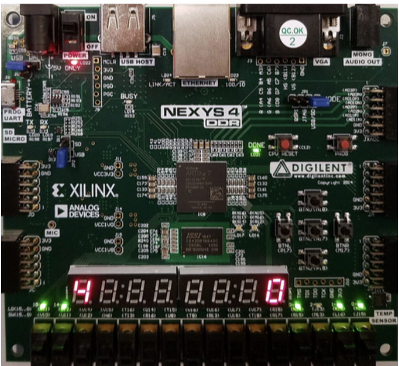
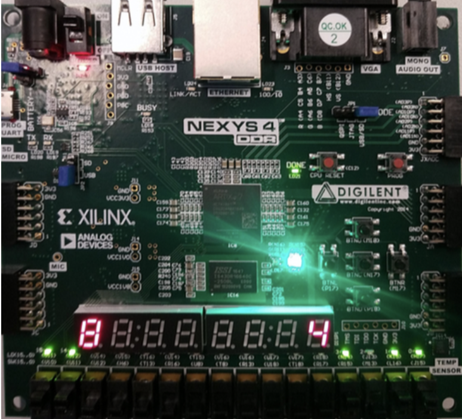

# Small Calculator

The purpose of this lab is to design a Small Calculator. In order to design the Small
Calculator, a Control Unit and Data Path must also be designed. The Data Path (DP) uses a
Register File in order to store two inputs into two registers, and an operation is performed on
these two inputs and stored into a third register. 

The Control Unit (CU) is a finite state machine
that controls the Data Path’s operations by sending out the control signals for each state.

The waveform (below) CS_tb[3:0] is showing the current state, and is verifying that
the test bench is transitioning to the correct state. This also depends on Op_tb[1:0]. The 2-bit
input that determines the operation in State 3. The State Transitions are correct for each
operation as defined in the ASM Chart

The Small Calculator test bench verifies that the overall system is working for two static
values 6 and 1. It cycles through each operation (Addition, Subtraction, AND, XOR),
and the state transition is observed in the waveform CS[3:0] for each operation. The states all
transition to the correct state, and at State 8 the Done flag is raised which properly shows that the
calculator has finished an operation.

Once the Small Calculator is designed and verified, a bitstream will be
generated and programmed onto the Nexys4 DDR FPGA Board. The Small Calculator will take
four inputs, two 3-Bit Inputs, a 2-Bit input that will set the operation, and a single bit Go input
that will start the state machine. The FPGA Board will then display the current state on one 7-
Segment Display, and the decimal value of the 3-bit output on another 7-Segment Display.

Val0 = 3, Val1 = 1, operation = +

Expected result 4

State progression

State progression (state 4)

Done flag with expected result